# NPC-Shelf Screenshots

UI reference screenshots captured during UX review (v0.10.x).

## Desktop

| View | Screenshot |
|------|------------|
| Dashboard | 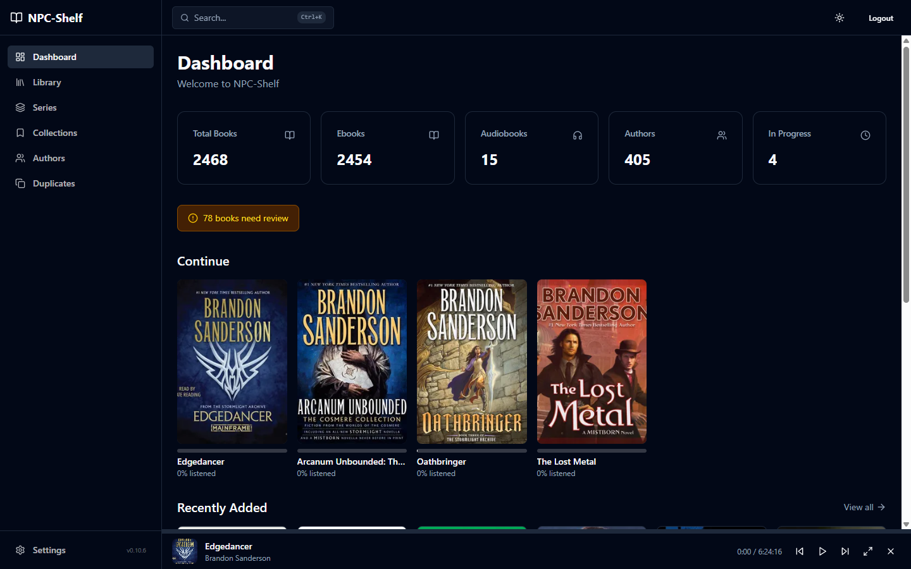 |
| Library | 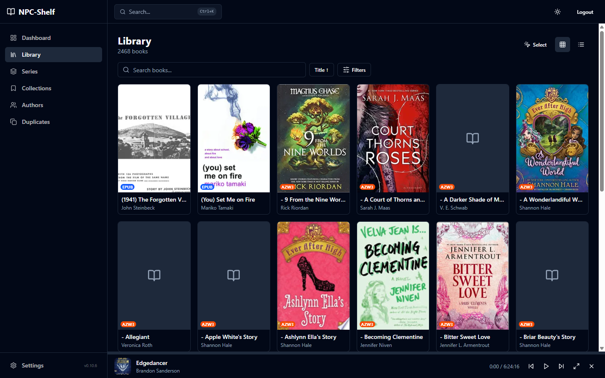 |
| Library (filters expanded) | 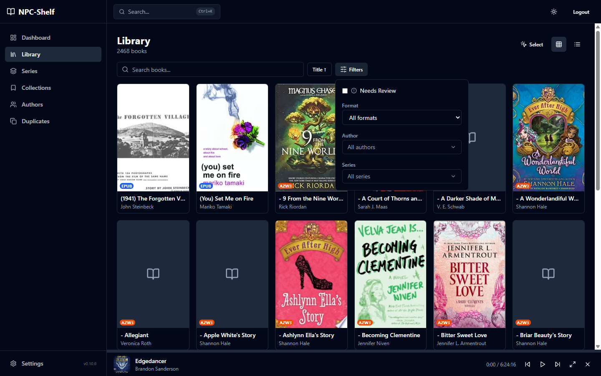 |
| Book Detail | 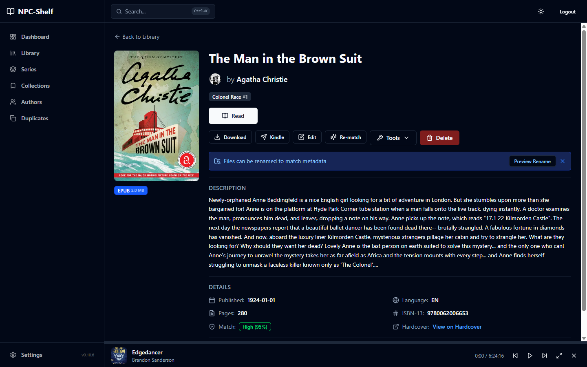 |
| Book Detail (tools dropdown) | 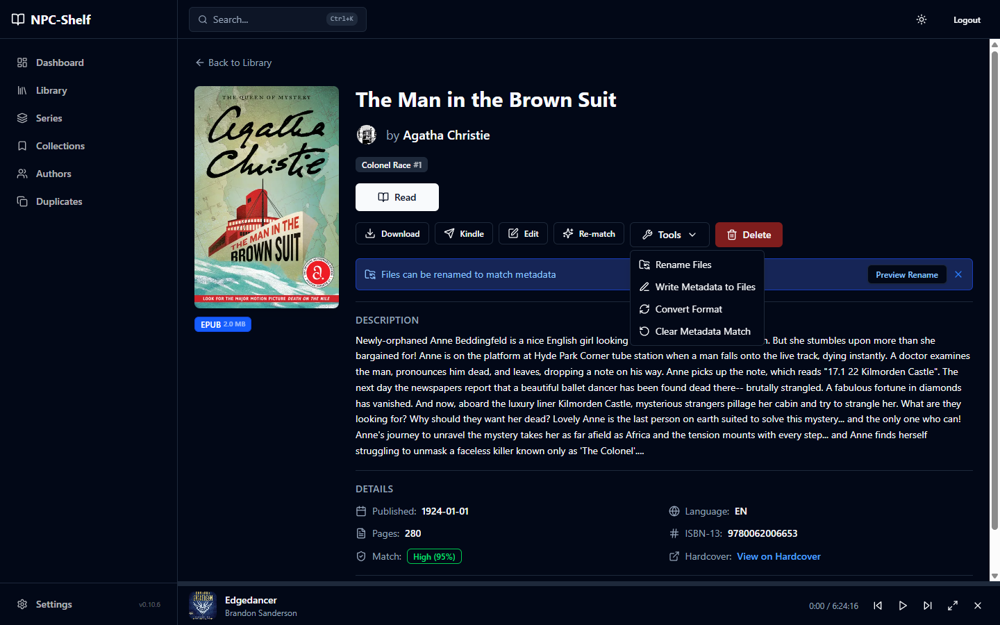 |
| Book Detail (mismatched metadata) | 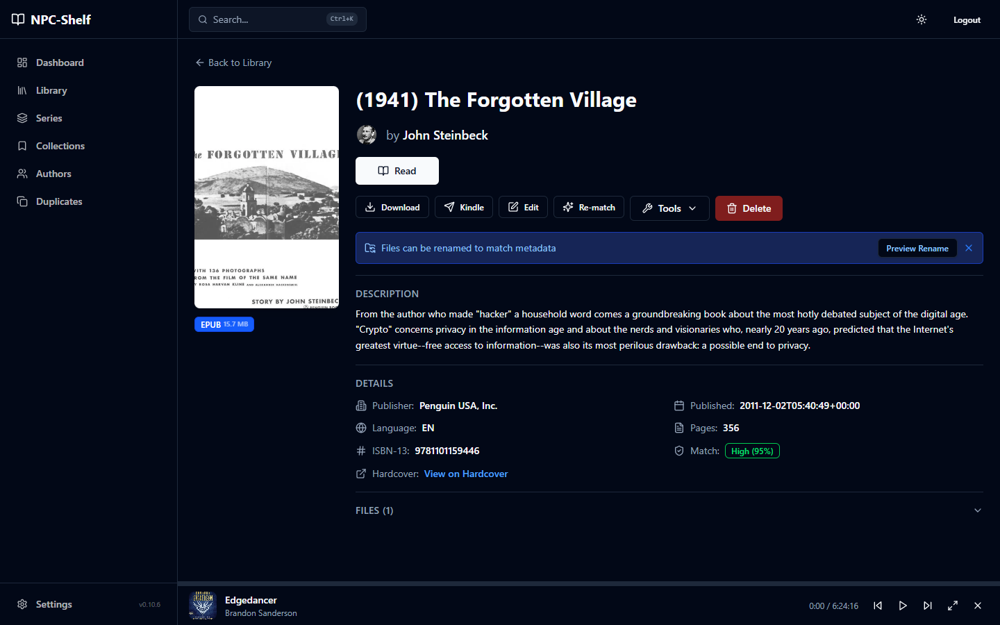 |
| Audio Player | 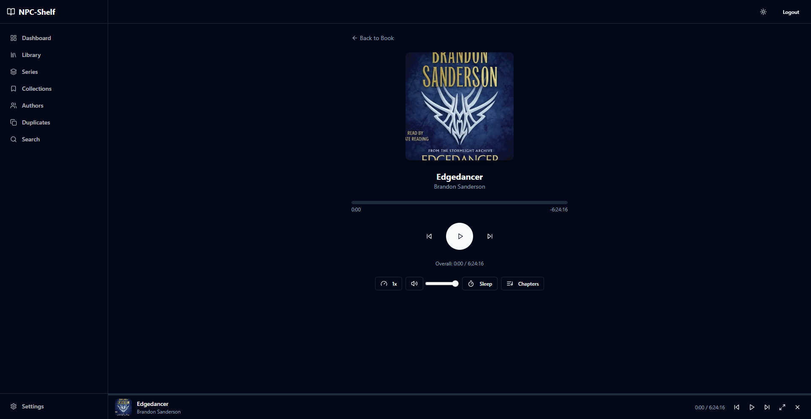 |
| Authors | 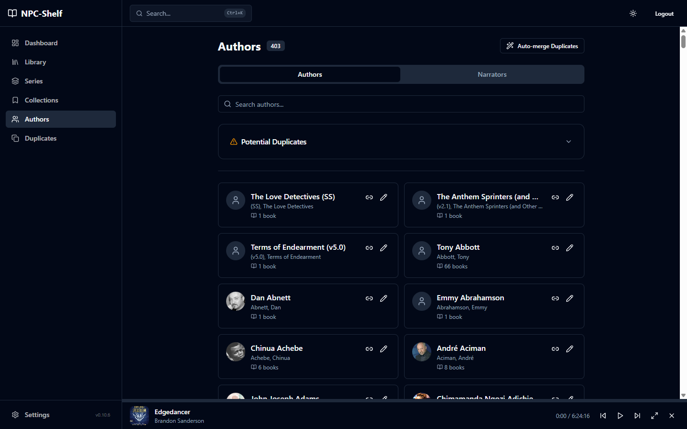 |
| Series | 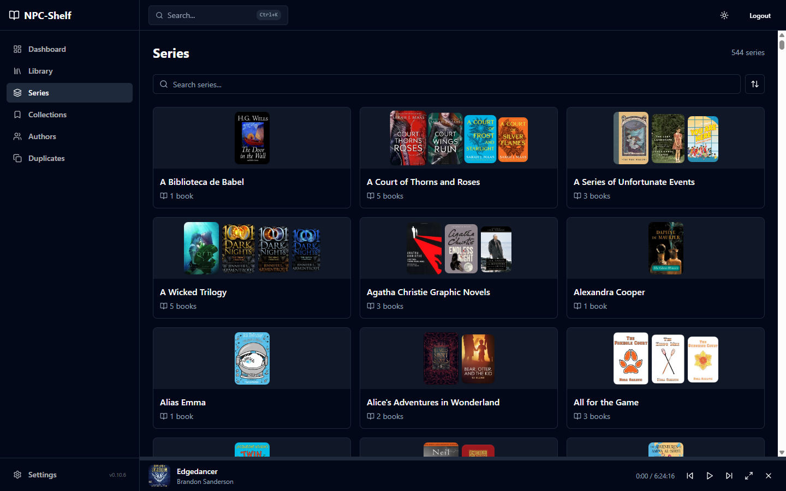 |
| Collections | 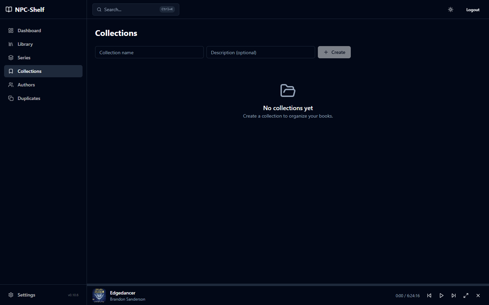 |
| Settings | 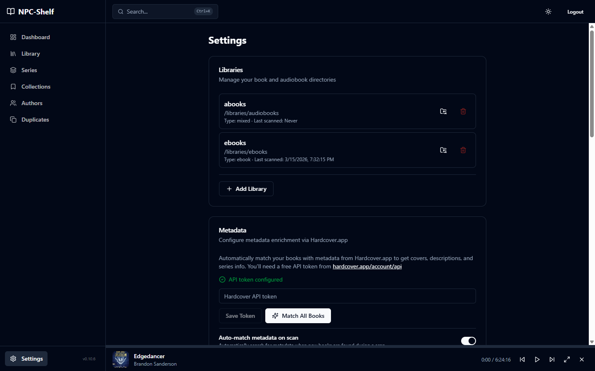 |
| Search Command Dialog | 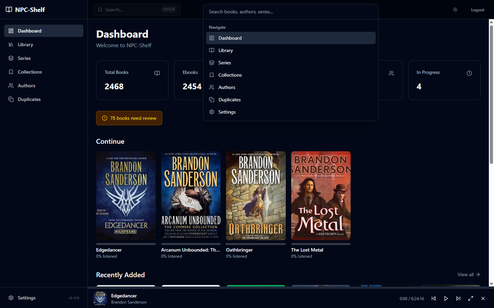 |
| Duplicates | 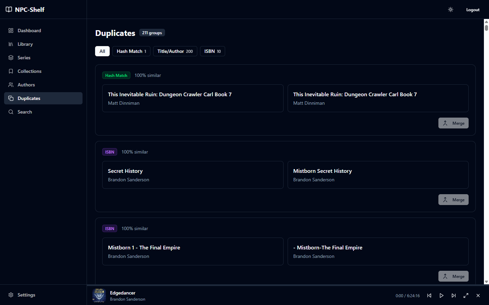 |
| Needs Review | 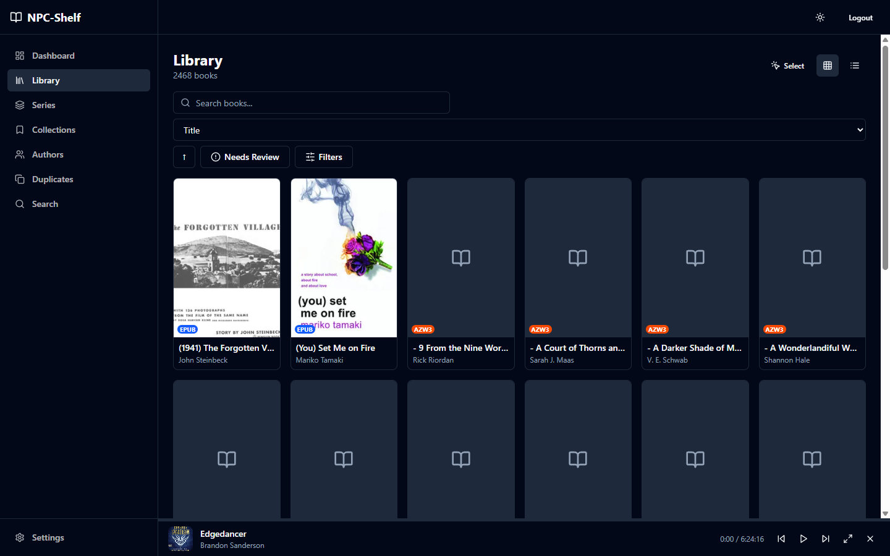 |

## Mobile

| View | Screenshot |
|------|------------|
| Dashboard | 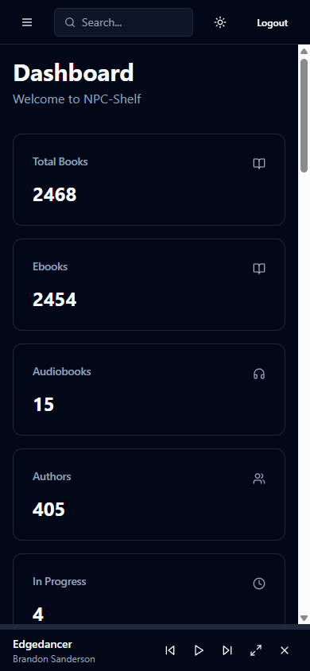 |
| Library | 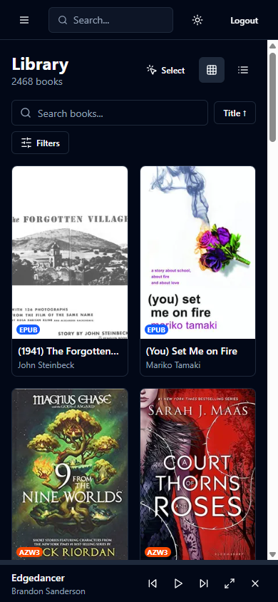 |
| Book Detail | 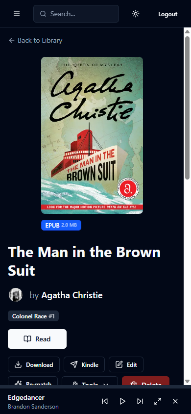 |
| Listen |  |
| Audio Player | 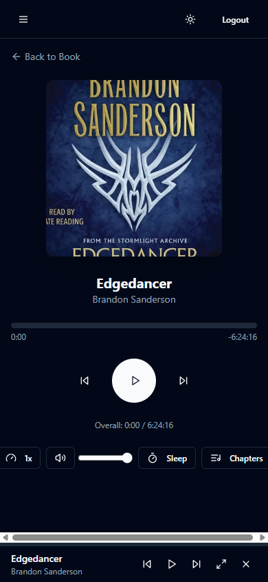 |
